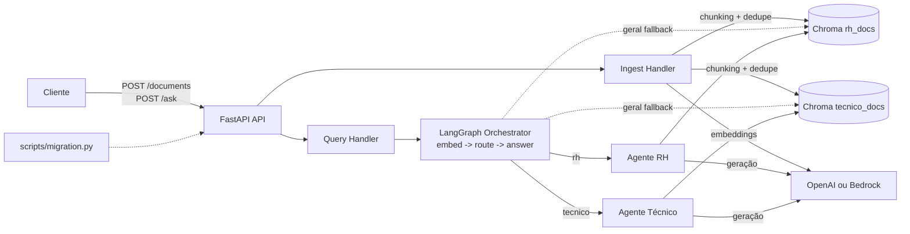

# Arquitetura da Aplicação

Diagrama editável (Draw.io): `docs/architecture.drawio`.

## Visão geral

## Componentes

- `src/main.py`: API REST e contratos de entrada/saída.
- `src/ingest/handler.py`: pipeline de ingestão com validação, hash de conteúdo, deduplicação e persistência.
- `src/query/handler.py`: validação da pergunta e entrada no fluxo LangGraph.
- `src/orchestrator/langgraph_router.py`: grafo `embed -> route -> answer`.
- `src/orchestrator/handler.py`: classificador híbrido por domínio (`rh`, `tecnico`, `geral`).
- `src/agents/*.py`: agentes especialistas por domínio e resposta final com fontes.
- `src/shared/chroma_client.py`: acesso ao Chroma com coleções separadas por domínio.
- `src/shared/embeddings.py` e `src/shared/llm.py`: abstração de provedor (OpenAI/Bedrock).

## Fluxo de ingestão

1. API recebe `content` e `domain` em `POST /documents`.
2. `handle_ingest` valida entrada e calcula `content_hash`.
3. Busca por duplicidade em Chroma via `content_hash`.
4. Se novo: faz chunking, gera embeddings e persiste metadados (`doc_id`, `domain`, `content_hash`, `chunk_index`).
5. Retorna `doc_id`, `chunks_count`, `domain` e `already_exists`.

## Fluxo de consulta

1. API recebe `question` em `POST /ask`.
2. `handle_ask` valida a pergunta e chama o LangGraph.
3. `embed_node` gera embedding da pergunta.
4. `route_node` classifica domínio (`rh`, `tecnico` ou `geral`).
5. `answer_node` usa agente especializado quando domínio é específico.
6. No fallback `geral`, `answer_node` consulta RH + técnico, combina resultados e responde com fontes.
